# 📚 Smart Library Request Workflow

<p align="center">
  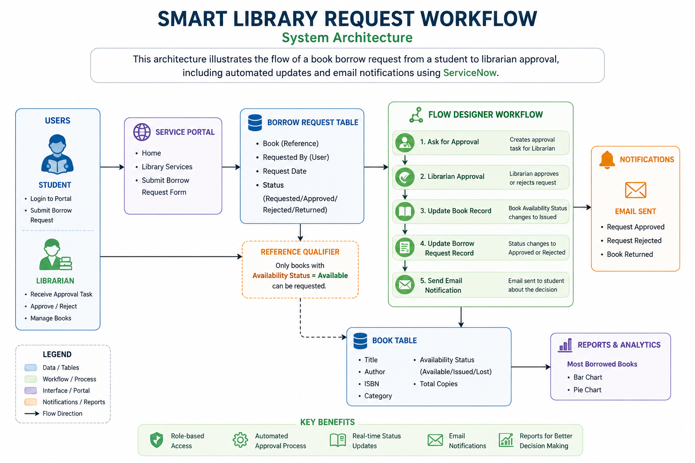
</p>

<p align="center">
  <b>A complete ServiceNow application for automating the Library Book Borrowing Process using Flow Designer, ACLs, UI Policies, Roles, Email Notifications, Reports, and Reference Qualifiers.</b>
</p>

---

# 📖 Project Overview

The **Smart Library Request Workflow** is a ServiceNow application designed to automate the library borrowing process.

The application enables students to submit book borrowing requests while allowing librarians to review, approve, or reject requests through an automated approval workflow.

The workflow automatically:

- Creates Borrow Requests
- Requests Librarian Approval
- Updates Book Availability
- Updates Borrow Request Status
- Sends Email Notifications
- Generates Reports

---

# ✨ Features

- 📚 Book Management
- 👨‍🎓 Student Borrow Requests
- 👩‍🏫 Librarian Approval Workflow
- 🔐 Role Based Access Control (ACL)
- 📧 Automatic Email Notifications
- ⚙️ Flow Designer Automation
- 📊 Reports & Analytics
- ✅ UI Policies
- 🔍 Reference Qualifier
- 📈 Borrow History Tracking

---

# 🛠 Technologies Used

| Technology | Purpose |
|------------|----------|
| ServiceNow Studio | Application Development |
| Flow Designer | Workflow Automation |
| Access Control Lists | Security |
| Roles | Authorization |
| UI Policies | Form Validation |
| Reference Qualifier | Filter Available Books |
| Reports | Analytics |
| Email Notifications | User Notification |

---

# 👥 User Roles

## 👨‍🎓 Student

- Search Books
- Submit Borrow Requests
- Track Request Status

---

## 📚 Librarian

- Manage Books
- Approve Requests
- Reject Requests
- View Reports

---

## 👨‍💼 Administrator

- Configure Application
- Manage Users
- Manage Security
- Monitor Flow

---

# 🗂 Database Tables

## 📚 Book Table

Fields

- Book ID
- Title
- Author
- Category
- ISBN
- Availability Status
- Total Copies

---

## 📄 Borrow Request Table

Fields

- Requested By
- Book
- Request Date
- Status

Status Values

- Requested
- Approved
- Rejected
- Returned

---

# 🏗 System Architecture

<p align="center">

</p>

---

# 🔄 Workflow

```text
Student
      │
      ▼
Borrow Request Created
      │
      ▼
Ask for Approval
      │
      ▼
Librarian Approval
      │
      ▼
Update Book Status
      │
      ▼
Update Borrow Request Status
      │
      ▼
Send Email Notification
```

---

# 🔐 Access Control Lists (ACL)

The project implements record-level ACLs for:

- Create
- Read
- Write
- Delete

Implemented for

- Book Table
- Borrow Request Table

Role Based Security ensures:

- Students access only borrowing functions.
- Librarians manage books and requests.
- Administrators configure the application.

---

# ⚙️ Flow Designer

The Flow Designer automates the entire borrowing process.

Flow Steps

1. Trigger Borrow Request
2. Ask For Approval
3. Librarian Approval
4. Update Book Record
5. Update Borrow Request
6. Send Email Notification

---

# 📊 Reports

Two ServiceNow reports were developed.

### 📈 Most Borrowed Books (Bar Chart)

Displays the number of borrow requests for each book.

### 🥧 Most Borrowed Books (Pie Chart)

Visual representation of book borrowing distribution.

---

# 📸 Project Screenshots

## Roles

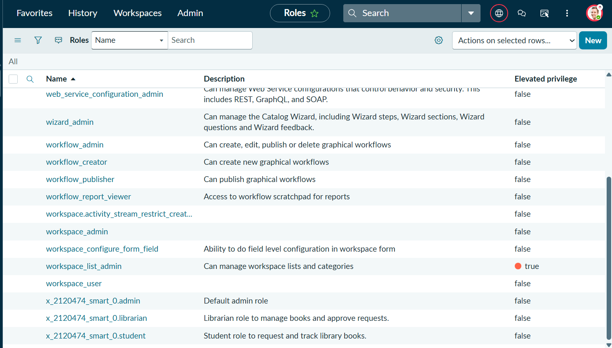

---

## Student User

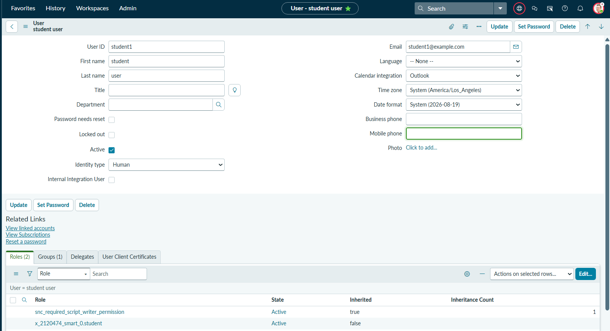

---

## Librarian User

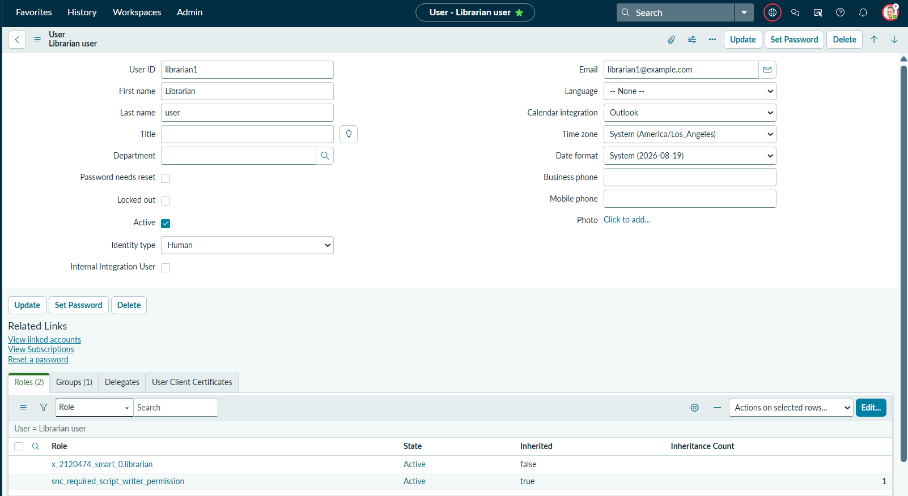

---

## Book Table

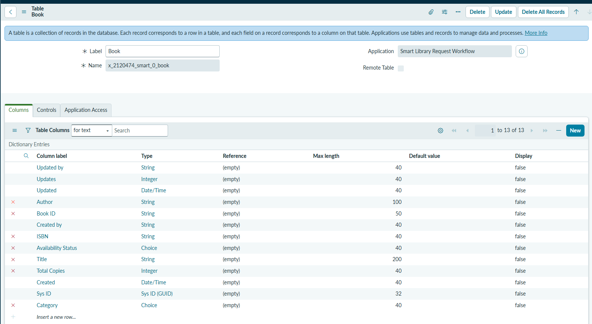

---

## Borrow Request Table

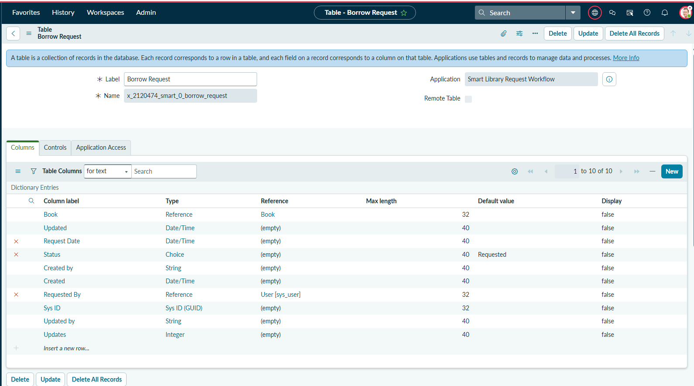

---

## Book Records

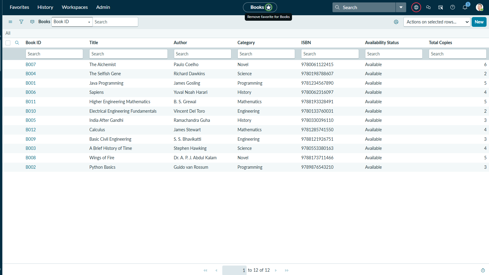

---

## Borrow Request Form


---

## Borrow Requests


---

## Trigger

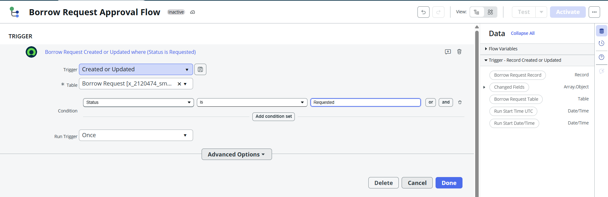

---

## Approval Action

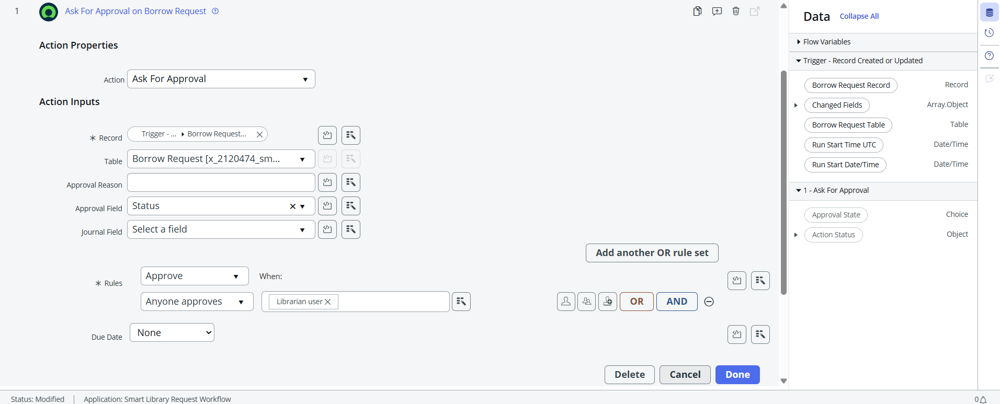

---

## Update Book

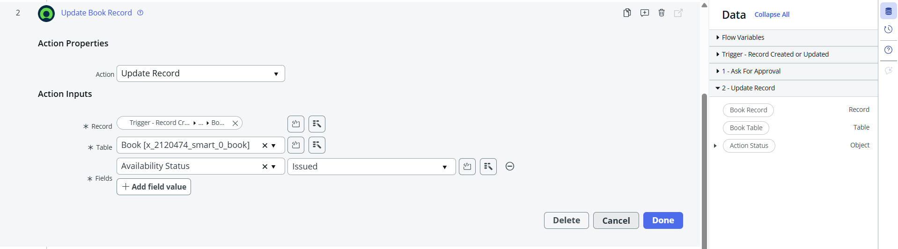

---

## Update Request

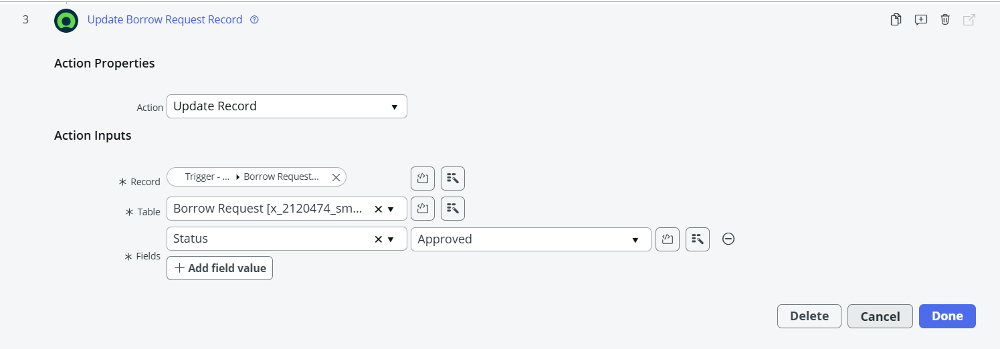

---

## Activated Flow

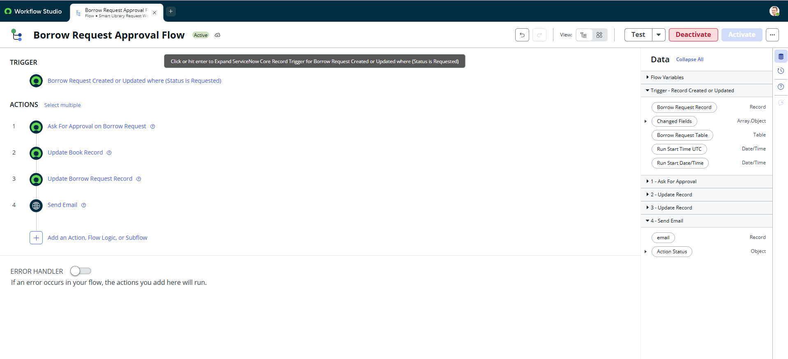

---

## Flow Execution


---

## Book Table ACL


---

## Borrow Request ACL


---

## UI Policy


---

## Reference Qualifier

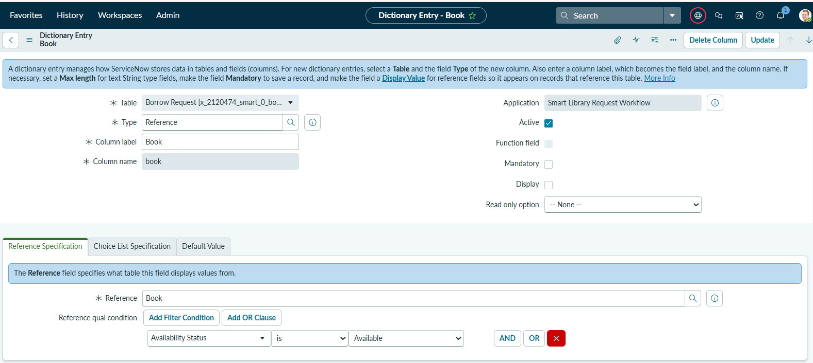

---

## Book Status


---

## Email Notification


---

## Send Email

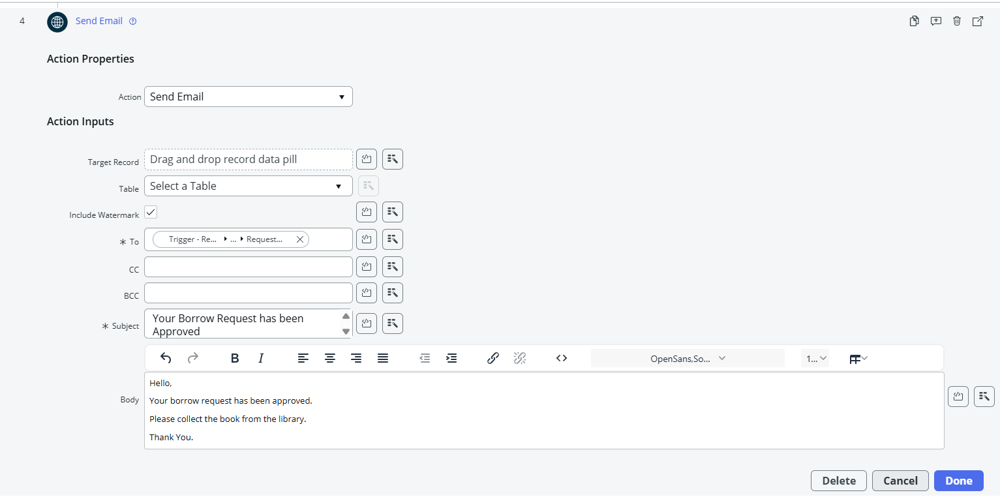

---

## Librarian User Approvals


---

## Most Borrowed Books - Bar Chart


---

## Most Borrowed Books - Pie Chart


---

# 📂 Repository Structure

```
Smart-Library-Request-Workflow-ServiceNow
│
├── Documentation
│   ├── Final Project Report
│   └── Architecture.png
│
├── Reports
│   ├── Most Borrowed Books Bar Chart Report.pdf
│   └── Most Borrowed Books Pie Chart Report.pdf
│
├── Screenshots
│   ├── 01_Roles_Created.png
│   ├── Activated_Flow.png
│   ├── Approval_Action.png
│   ├── Book Table ACL.png
│   ├── Book_Records.png
│   ├── Book_Table.png
│   ├── Books Status.png
│   ├── Borrow Request ACL.png
│   ├── Borrow Request Form.png
│   ├── Borrow Requests.png
│   ├── Borrow_Request_Table.png
│   ├── Email Notification.png
│   ├── Flow Execution.png
│   ├── Librarian User Approvals.png
│   ├── Librarian_User.png
│   ├── Most Borrowed Books Bar Chart Report.png
│   ├── Most Borrowed Books Pie Chart Report.png
│   ├── Reference_Qualifier.png
│   ├── Send_E-mail.png
│   ├── Student_User.png
│   ├── Trigger.png
│   ├── UI Policy.png
│   ├── Update_Book.png
│   └── Update_Request.png
│
├── Demo_Link.txt
└── README.md
```

---

# 🎥 Project Demonstration

Google Drive Folder

https://drive.google.com/drive/folders/1DKtuXi0ce_UnRyG2awF13NEzkjMuGnyF?usp=drive_link

Videos Included

- Smart Library Request Workflow Demo
- Borrow Request Creation
- Borrow Request Approval Workflow

---

# 🚀 Future Enhancements

- Book Return Workflow
- Fine Calculation
- Due Date Reminder
- Book Reservation
- Dashboard Analytics
- Barcode Integration
- RFID Support

---

# 📚 Learning Outcomes

Through this project, the following ServiceNow concepts were implemented:

- ServiceNow Studio
- Flow Designer
- ACL
- Roles
- UI Policies
- Reports
- Reference Qualifier
- Email Notifications
- ServiceNow Application Development

---

# 👨‍💻 Developer

**Konduru Nanda Kishore Reddy**

Final Year B.Tech Student


---

# ⭐ Support

If you found this project useful, consider giving this repository a ⭐.
